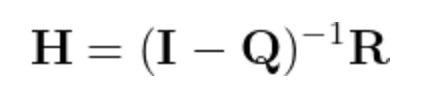

# Hitting probabilities using linear algebra

If you have a Markov chain with a mixture of transient and absorbing states such as the one illustrated in the transition graph below the chain will eventually end up in one of the absorbing states.


For the chain above the system will eventually either be absorbed in state 1 or state 5.  Furthermore, in previous exercises we have learned how quantities such as the conditional probability of finishing in state 5 given you start in state 2 can be calculated by sampling the Markov chain repeatedely.  These quantities can also be calculated using linear algebra, however.  In this exercise, I am going to show you how this can be done using computer by considering the Markov chain with the transition graph above.

The transition matrix that corresponds to the Markov chain in the figure above is as follows:


It is straightforward to show that the matrix of hitting probabilities can be calculated using:



In this expression, I is the identity matrix, Q is a matrix that describes the transition probablities between the transient states and R is a matrix that describes the transition probabilities from the transient states to the absorbing states.  For the Markov chain whose transition matrix is given above Q and R are given by:


Remember that you can set a variables equal to Q and R by using the `np.array` command.  You can then get a 3x3 identity matrix by using the following command:

```python
I = np.identity(3)
```

To invert the matrix `A` you can use the following command:

```python
inv = np.linalg.inv( A )
```

Lastly, if you want to multiply the matrix `A` by the matrix `B` you use:

```python
# The quantity C that is output here is a matrix
C = np.dot(  A, B )
```

You should be able to use the commands above to compute the hitting probabilities using the formula above.  Your task here is, therefore, to use these ideas to draw a bar chart.  The x-coordinates of the bars should be set equal to the label for the initial transient states in the graph above.  The heights of the bars should then be equal to the probability of absorption in state 5.  The title for the x-axis should be "Initial state".  The title for the y-axis should be "Probability of absorption in state 5".

